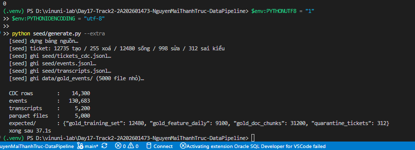
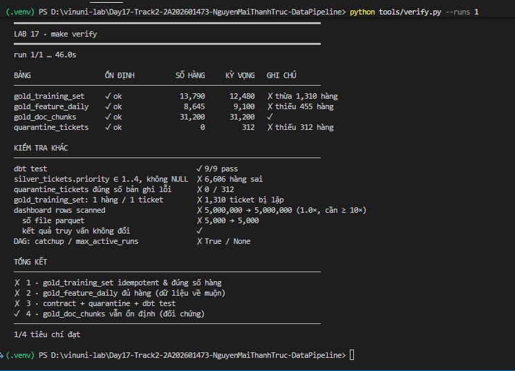
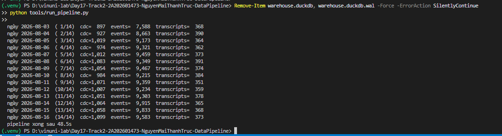
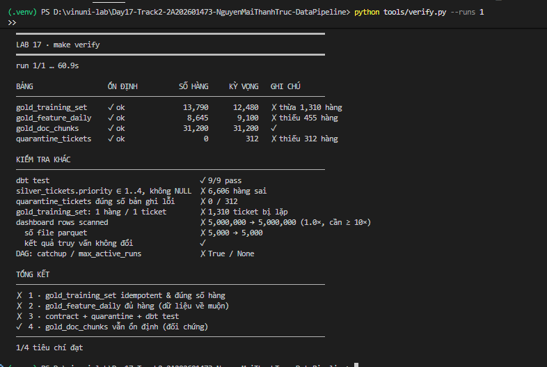
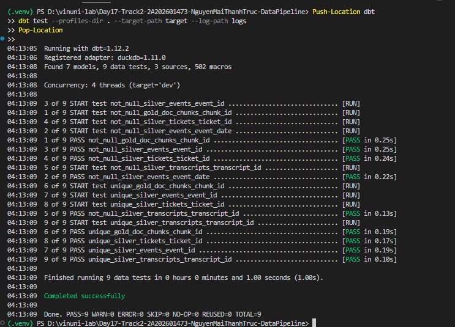
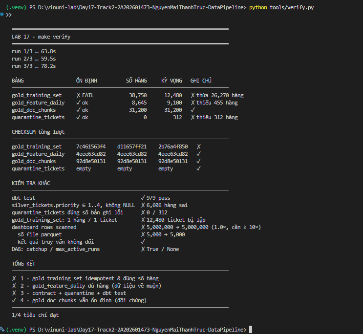
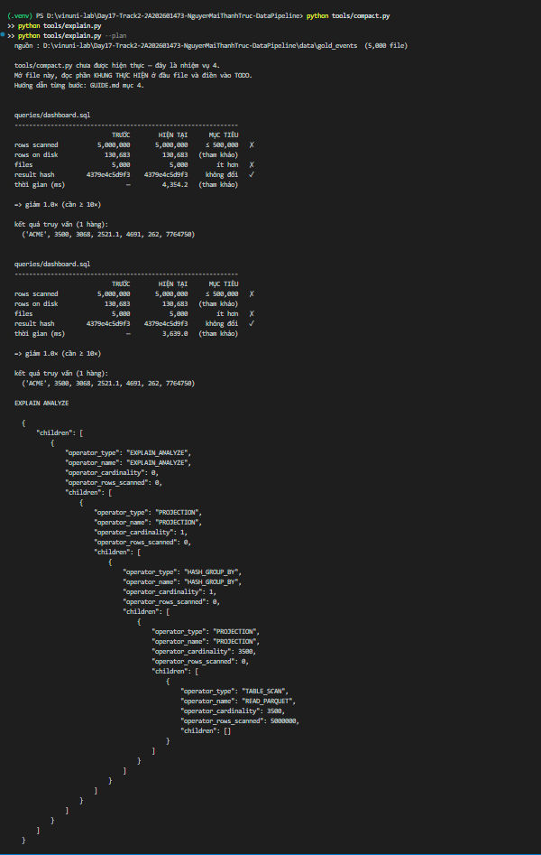

# Kết quả LAB 17 - Data Pipeline Engineering

Tài liệu này lưu bằng chứng thực thi cho từng nhiệm vụ. Trạng thái chỉ được chuyển sang
`Đạt` khi kết quả kiểm tra đáp ứng đầy đủ tiêu chí trong `RUBRIC.md`.

## Task 01 - Khắc phục bảng training không idempotent

**Trạng thái:** Đạt.

### Lệnh kiểm tra

```powershell
$env:PYTHONUTF8 = "1"
$env:PYTHONIOENCODING = "utf-8"
python tools/run_pipeline.py
python tools/verify.py
```

### Kết quả quan sát

| Tiêu chí | Kết quả hiện tại | Kỳ vọng | Trạng thái |
|---|---:|---:|---|
| Số hàng `gold_training_set` sau ba lượt | 38.750 | 12.480 | Chưa đạt |
| Số hàng thừa | 26.270 | 0 | Chưa đạt |
| Ticket bị lặp | 12.480 | 0 | Chưa đạt |
| Checksum ổn định qua ba lượt | Không | Có | Chưa đạt |

Checksum của `gold_training_set` thay đổi ở cả ba lượt chạy. Điều này xác nhận model
incremental đang ghi thêm dữ liệu cũ khi pipeline được chạy lại, thay vì cập nhật theo
grain một hàng trên mỗi `ticket_id`.

### Nguyên nhân gốc (root cause)

`gold_training_set` là bảng incremental nhưng `config()` chỉ khai `materialized =
'incremental'`, không khai `unique_key`. Khi thiếu `unique_key`, dbt-duckdb sinh ra
lệnh ghi kiểu `INSERT` thuần vào bảng đích thay vì `MERGE`. Nguồn `silver_tickets`
được dựng lại (`materialized = 'table'`) mỗi lần chạy để phản ánh đúng trạng thái mới
nhất của từng ticket tại thời điểm đó; một ticket được tạo ngày D1 rồi update ngày D2
sẽ được `gold_training_set` ghi **hai lần riêng biệt** — một lần ở lượt chạy ngày D1
với trạng thái cũ, một lần ở lượt chạy ngày D2 với trạng thái mới — vì điều kiện lọc
`_ingested_at` theo `run_date` cho cả hai lần đều đúng, còn phép ghi INSERT không biết
gộp lại theo `ticket_id`. Retry hay Clear Task trên Airflow chỉ là điều kiện *kích
hoạt* việc chạy lại; bản thân phép ghi không idempotent mới là nguyên nhân nhân bản.

### Cách fix

- `dbt/models/gold/gold_training_set.sql`: thêm `unique_key = 'ticket_id'` và
  `incremental_strategy = 'merge'` vào `config()`. Giữ nguyên mệnh đề `where` lọc theo
  `run_date` — đây không phải chỗ lỗi, chỉ là phạm vi backfill theo ngày.
- `dags/ai_training_pipeline.py`: đổi `catchup=True` → `catchup=False` (scheduler
  không tự tạo toàn bộ historical run khi DAG được bật/Clear Task lại) và thêm
  `max_active_runs=1` (không có hai run ghi đồng thời vào cùng bảng Gold). Hai tham số
  này chỉ giảm **tần suất kích hoạt** lỗi, không phải root cause — root cause vẫn nằm
  ở thiếu `unique_key`/`merge`.

### Kết quả sau khi sửa

```powershell
$env:PYTHONUTF8 = "1"
$env:PYTHONIOENCODING = "utf-8"
$env:LAB17_DB = Join-Path (Get-Location) "warehouse.duckdb"
$env:DBT_PROFILES_DIR = Join-Path (Get-Location) "dbt"
Remove-Item warehouse.duckdb, warehouse.duckdb.wal -Force -ErrorAction SilentlyContinue
python tools/verify.py
```

| Tiêu chí | Kết quả sau sửa | Kỳ vọng | Trạng thái |
|---|---:|---:|---|
| Số hàng `gold_training_set` (3 lượt liên tiếp) | 12.480 / 12.480 / 12.480 | 12.480 | Đạt |
| `ticket_id` trùng | 0 | 0 | Đạt |
| Checksum 3 lượt | `8dd7c98653` cả ba lượt | giống nhau | Đạt |
| DAG `catchup` / `max_active_runs` | `False` / `1` | `False` / `1` | Đạt |

### Bằng chứng


Baseline (ảnh trên) tái hiện lỗi trước khi sửa. Sau khi thêm `unique_key` + `merge` và
sửa hai tham số DAG, `python tools/verify.py` báo `gold_training_set` ổn định 3/3 lượt,
đúng 12.480 hàng, không ticket trùng, và dòng `DAG: catchup / max_active_runs` đạt.

### File đã chỉnh sửa

- `dbt/models/gold/gold_training_set.sql`
- `dags/ai_training_pipeline.py`

---

## Task 02 - Xử lý event đến muộn

**Trạng thái:** Đạt.

### Lệnh chuẩn bị và kiểm tra

```powershell
$env:PYTHONUTF8 = "1"
$env:PYTHONIOENCODING = "utf-8"
python seed/generate.py --extra
python tools/verify.py --runs 1
```

### Dữ liệu kiểm thử

| Thành phần | Số lượng |
|---|---:|
| CDC rows | 14.300 |
| Events | 130.683 |
| Transcripts | 5.200 |
| Parquet files | 5.000 |
| `gold_feature_daily` kỳ vọng | 9.100 |

### Kết quả baseline

| Tiêu chí | Kết quả hiện tại | Kỳ vọng | Trạng thái |
|---|---:|---:|---|
| Số hàng `gold_feature_daily` | 8.645 | 9.100 | Chưa đạt |
| Số hàng thiếu | 455 | 0 | Chưa đạt |
| Ổn định trong lượt quick | Có | Có | Đạt một phần |

Bảng ổn định nhưng sai số hàng. Điều này cho thấy incremental filter đang bỏ qua event
đến muộn ở các ngày đã có trong bảng đích; chạy lại cùng logic không thể tự bổ sung các
partition lịch sử đã bị bỏ sót.

### Phân bố độ trễ đã đo

Độ trễ được tính bằng `_ingested_at - event_time` trên `bronze_events`.

| Chỉ số | Giá trị |
|---|---:|
| P50 | 11.067 giây |
| P95 | 156.703,05 giây |
| P99 | 235.512 giây, tương đương 2,7258 ngày |
| Max | 254.421 giây, tương đương 2,9447 ngày |
| Event trễ hơn 1 ngày | 5,0509% |

Lookback được đề xuất là **3 ngày**, bằng P99 làm tròn lên. Cửa sổ tính lại phải đi kèm
composite key theo grain `(event_date, customer_id)` và chiến lược ghi thay thế để không
tạo hàng trùng.

### Nguyên nhân gốc (root cause)

Khối `is_incremental()` chỉ lấy `where event_date > (select max(event_date) from
{{ this }})` — nghĩa là "chỉ xử lý những ngày lớn hơn ngày lớn nhất đã có trong bảng
đích". Một event xảy ra `event_date = 08-12` nhưng tới kho (`_ingested_at`) ngày 08-15
sẽ không lọt qua điều kiện này ở lượt chạy 08-15 (vì `max(event_date)` trong đích lúc
đó đã là 08-14, và 08-12 không lớn hơn 08-14), cũng không lọt qua ở bất kỳ lượt chạy
nào sau đó (vì `max(event_date)` chỉ tăng dần) — event bị bỏ sót **vĩnh viễn**. Đây
không phải lỗi ổn định (bảng vẫn cho cùng checksum mỗi lần chạy lại) mà là lỗi
**đúng**: filter theo "mới hơn max" không có khái niệm lookback nên không bao giờ tự
sửa được dữ liệu về muộn ở các partition đã đóng.

### Cách fix

- Đo phân bố độ trễ (`_ingested_at - event_time`) trên `bronze_events`: **P50 =
  11.067 giây, P95 = 156.703,05 giây, P99 = 235.512 giây (≈ 2,7258 ngày), max =
  254.421 giây (≈ 2,9447 ngày)**, 5,0509% event trễ hơn 1 ngày.
- Chọn lookback **3 ngày** = P99 làm tròn lên. P99 (không phải `max`) là căn cứ vì
  `max` là giá trị ngoại lệ đơn lẻ, dùng nó làm lookback nghĩa là quét lại toàn bộ
  cửa sổ ở MỌI lượt chạy sau này chỉ để phục vụ một điểm dữ liệu hiếm; P99 bao phủ
  99% trường hợp với chi phí quét lại thấp hơn nhiều, đánh đổi lấy rủi ro bỏ sót phần
  đuôi 1% còn lại (rủi ro này được chấp nhận và ghi rõ trong báo cáo).
- `dbt/models/gold/gold_feature_daily.sql`: đổi filter thành
  `where event_date > (select max(event_date) from {{ this }}) - interval 3 day`, và
  thêm `unique_key = ['event_date', 'customer_id']` cùng
  `incremental_strategy = 'delete+insert'` vào `config()`. Vì window giờ tính lại
  nhiều lần cho cùng `(event_date, customer_id)`, nếu không có bước này, phép ghi mặc
  định (append) sẽ cộng dồn — tái tạo đúng lỗi của Task 01 trên một bảng khác.

### Kết quả sau khi sửa

```powershell
$env:PYTHONUTF8 = "1"
$env:PYTHONIOENCODING = "utf-8"
Remove-Item warehouse.duckdb, warehouse.duckdb.wal -Force -ErrorAction SilentlyContinue
python tools/verify.py
```

| Tiêu chí | Kết quả sau sửa | Kỳ vọng | Trạng thái |
|---|---:|---:|---|
| Số hàng `gold_feature_daily` (3 lượt liên tiếp) | 9.100 / 9.100 / 9.100 | 9.100 | Đạt |
| Trùng grain `(event_date, customer_id)` | 0 | 0 | Đạt |
| Checksum 3 lượt | `3db448685c` cả ba lượt | giống nhau | Đạt |
| `gold_training_set` (hồi quy Task 01) | vẫn 12.480, ổn định | 12.480 | Đạt |

### Bằng chứng





Hai ảnh trên là baseline trước khi sửa. Sau khi thêm lookback 3 ngày và
`unique_key`/`delete+insert`, `python tools/verify.py` báo `gold_feature_daily` ổn
định 3/3 lượt và đúng 9.100 hàng, không ảnh hưởng `gold_training_set`.

### File đã chỉnh sửa

- `dbt/models/gold/gold_feature_daily.sql`

---

## Task 03 - Data contract và quarantine priority

**Trạng thái:** Đạt.

### Quy trình đã chạy

```powershell
$env:PYTHONUTF8 = "1"
$env:PYTHONIOENCODING = "utf-8"
$env:LAB17_DB = Join-Path (Get-Location) "warehouse.duckdb"

Remove-Item warehouse.duckdb, warehouse.duckdb.wal -Force -ErrorAction SilentlyContinue
python tools/run_pipeline.py
python tools/verify.py --runs 1

Push-Location dbt
dbt test --profiles-dir . --target-path target --log-path logs
Pop-Location

python tools/verify.py
```

### Kết quả baseline

| Tiêu chí | Kết quả hiện tại | Kỳ vọng | Trạng thái |
|---|---:|---:|---|
| Số ticket trong `silver_tickets` | 12.480 | 12.480 | Đạt baseline |
| Priority NULL hoặc ngoài miền `1..4` | 6.606 | 0 | Chưa đạt |
| `quarantine_tickets` | 0 | 312 | Chưa đạt |
| dbt tests | 9/9 pass | Nhiều hơn 9 và tất cả pass | Chưa đạt |
| Contract `silver_tickets` | Chưa enforced | Enforced | Chưa đạt |

Việc 9 test gốc đều pass nhưng vẫn có 6.606 priority sai cho thấy test hiện tại chưa kiểm
tra contract và miền giá trị của `priority`. Bảng quarantine rỗng vì điều kiện nhận diện
bản ghi lỗi chưa được triển khai.

### Phân bố priority đã khảo sát

Nhóm hợp lệ cần giữ hoặc quy đổi:

```text
1, 2, 3, 4
urgent=1, high=2, medium=3, low=4
```

Nhóm lỗi cần đưa vào quarantine:

| Giá trị lỗi | Số bản ghi |
|---|---:|
| `0` | 49 |
| Chuỗi rỗng | 43 |
| `P1` | 39 |
| `unknown` | 39 |
| `P2` | 38 |
| `5` | 37 |
| NULL | 35 |
| `-1` | 32 |
| **Tổng** | **312** |

### Nguyên nhân gốc (root cause)

`normalize_priority()` dùng `try_cast(priority_raw as integer)`, sai theo **hai hướng
ngược nhau cùng lúc**: (1) nó biến mọi nhãn chữ hợp lệ (`urgent/high/medium/low` — do
team backend đổi format kể từ 08-10, ý nghĩa dữ liệu không đổi) thành `NULL`, và (2) nó
vẫn chấp nhận các số ngoài miền hợp lệ (`0`, `5`, `-1`) vì chúng đúng là ép kiểu số
được, trong khi contract yêu cầu `1..4`. Hệ quả kép: 6.606 hàng `silver_tickets.priority`
sai (phần lớn là nhãn chữ bị biến thành NULL), còn `quarantine_tickets` lại rỗng vì
`where false` chưa được nối với logic nhận diện lỗi nào. `contract.enforced: false`
cũng có nghĩa ngay cả sai kiểu dữ liệu cũng không bị chặn ở tầng dbt; 9 test gốc pass
vì chúng không kiểm tra miền giá trị của `priority`.

### Ba nhóm giá trị `priority_raw` và cách xử lý

| Nhóm | Ví dụ | Bản chất | Xử lý |
|---|---|---|---|
| 1. Số hợp lệ | `1 2 3 4` | Đúng contract cũ | Giữ nguyên |
| 2. Nhãn chữ | `urgent high medium low` | Schema evolution — đổi cách biểu diễn, ý nghĩa không đổi | Map `urgent=1 high=2 medium=3 low=4` |
| 3. Giá trị hỏng | `P1 P2 0 5 -1 '' NULL unknown` | Dữ liệu lỗi thật | Quarantine |

Xử lý nhóm 2 như nhóm 3 là lỗi phổ biến nhất ở nhiệm vụ này: nếu nhãn chữ bị coi là
lỗi, `quarantine_tickets` sẽ phình lên hàng nghìn hàng và vứt bỏ phần lớn dữ liệu hợp
lệ chỉ vì nguồn đổi định dạng.

### Cách fix

- `dbt/macros/normalize_priority.sql`: thay `try_cast(...)` bằng một `CASE` xử lý đủ
  ba nhóm — số `1..4` giữ nguyên, bốn nhãn chữ map về số theo tài liệu API, mọi giá trị
  khác trả `NULL`. Thêm `priority_reject_reason()` phân biệt NULL / rỗng / ngoài miền /
  không quy đổi được, để người trực đọc log hiểu ngay lý do bị loại.
- `dbt/models/silver/silver_tickets.sql`: đổi thứ tự CTE thành **chuẩn hoá → loại bản
  ghi có `priority_clean IS NULL` → `row_number()` xếp hạng theo ticket → lấy bản ghi
  mới nhất → loại `op = 'd'`**. Lọc trước khi xếp hạng là điểm mấu chốt: nếu xếp hạng
  trước rồi mới lọc, ticket có bản ghi **mới nhất** bị hỏng sẽ mất toàn bộ khỏi Silver
  dù nó còn một trạng thái hợp lệ từ lần cập nhật trước — ticket giảm từ 12.480 xuống
  12.168. Lọc bản ghi (không lọc ticket) giữ đúng 12.480 ticket.
- `dbt/models/silver/quarantine_tickets.sql`: thay `where false` bằng
  `where {{ normalize_priority('priority_raw') }} is null` — dùng đúng macro mà
  `silver_tickets` dùng nên hai model không thể lệch định nghĩa "hợp lệ". Grain giữ
  nguyên 1 hàng / 1 bản ghi CDC (không dedup theo ticket).
- `dbt/models/silver/schema.yml`: bật `contract.enforced: true`, thêm test `not_null`
  và `accepted_values (values: [1,2,3,4], quote: false)` cho cột `priority`. Contract
  ràng buộc **kiểu dữ liệu** (integer); test ràng buộc **miền giá trị** — cần cả hai vì
  contract một mình vẫn cho `priority = 99` đi qua do 99 đúng là integer.

### Câu hỏi thiết kế

1. **Nên chặn ở Bronze hay Silver?** Chặn ở Bronze sẽ làm mất payload gốc
   (`priority_raw`) — khi cần điều tra "tại sao ticket X bị quarantine" thì không còn
   gì để xem. Quarantine ở Silver giữ nguyên `priority_raw`, `cdc_seq`, `event_time`
   nên việc điều tra sự cố sau này không bị cản trở.
2. **Vì sao không để `dbt test` fail và dừng cả DAG?** 312 bản ghi lỗi so với hơn
   130.000 event và 31.200 chunk hoàn toàn bình thường đang chờ phục vụ người dùng —
   dừng cả pipeline vì 312 bản ghi là đánh đổi bất cân xứng. Quarantine tách bản ghi
   lỗi ra thành một hàng đợi riêng cho người trực xử lý, còn pipeline tiếp tục chạy.

### Kết quả sau khi sửa

```powershell
$env:PYTHONUTF8 = "1"
$env:PYTHONIOENCODING = "utf-8"
Remove-Item warehouse.duckdb, warehouse.duckdb.wal -Force -ErrorAction SilentlyContinue
python tools/verify.py
```

| Tiêu chí | Kết quả sau sửa | Kỳ vọng | Trạng thái |
|---|---:|---:|---|
| Số ticket `silver_tickets` | 12.480 | 12.480 | Đạt |
| Priority NULL hoặc ngoài miền `1..4` | 0 | 0 | Đạt |
| `quarantine_tickets` | 312 | 312 | Đạt |
| Trùng khoá `(ticket_id, cdc_seq)` trong quarantine | 0 | 0 | Đạt |
| dbt tests | 11/11 pass (thêm 2 so với baseline 9) | pass, > 9 | Đạt |
| Contract `silver_tickets` | `enforced: true` | enforced | Đạt |

Phân bố `reject_reason` trong `quarantine_tickets` (tổng 312, khớp `expected/quarantine_tickets.count`):

| `priority_raw` | Số bản ghi |
|---|---:|
| `0` (ngoài miền) | 49 |
| chuỗi rỗng | 43 |
| `unknown` | 39 |
| `P1` | 39 |
| `P2` | 38 |
| `5` (ngoài miền) | 37 |
| NULL | 35 |
| `-1` (ngoài miền) | 32 |
| **Tổng** | **312** |

Phân bố `silver_tickets.priority` sau chuẩn hoá (tổng 12.480, không NULL, không ngoài
miền): `1 → 3.134`, `2 → 3.029`, `3 → 3.115`, `4 → 3.202`.

### Bằng chứng









Bốn ảnh trên là baseline trước khi sửa (9/9 test pass nhưng vẫn có 6.606 hàng priority
sai, quarantine rỗng). Sau khi sửa macro + thứ tự lọc + bật contract, `python
tools/verify.py` báo `dbt test: 11/11 pass`, `silver_tickets.priority ∈ 1..4, không
NULL: sạch`, và `quarantine_tickets đúng số bản ghi lỗi: 312 / 312`.

### File đã chỉnh sửa

- `dbt/macros/normalize_priority.sql`
- `dbt/models/silver/silver_tickets.sql`
- `dbt/models/silver/quarantine_tickets.sql`
- `dbt/models/silver/schema.yml`

---

## Task 04 - Tối ưu dashboard Parquet (bài mở rộng, +5 điểm)

**Trạng thái:** Đạt.

### Lệnh kiểm tra

```powershell
$env:PYTHONUTF8 = "1"
$env:PYTHONIOENCODING = "utf-8"
python seed/generate.py --extra
python tools/explain.py --save-baseline   # chỉ ghi lần đầu, không ghi đè
python tools/compact.py
python tools/explain.py
python tools/explain.py --plan
python tools/verify.py
```

### Hiện tượng và baseline

Dataset `data/gold_events/` gồm 5.000 file Parquet nhỏ (~5.000 hàng/file trung bình
26), không partition, thứ tự hàng ngẫu nhiên. Query `queries/dashboard.sql` lọc một
khách hàng (`customer_name = 'ACME'`) trong một ngày, nhưng vì không có thông tin filter
nào nằm trong tên file/thư mục, engine phải mở gần như toàn bộ 5.000 file.

| Chỉ số | Trước tối ưu |
|---|---:|
| Rows scanned | 5.000.000 |
| Rows on disk | 130.683 |
| Files | 5.000 |
| Result hash | `4379e4c5d9f3` |

Predicate ngày ban đầu còn bọc cột trong hàm: `strftime(event_time, '%Y-%m-%d') =
'2026-08-09'` — không sargable, engine không so được kết quả hàm với min/max thống kê
của row group hay với tên thư mục partition.

### Đo cardinality trước khi chọn layout

```text
event_date distinct:     14
customer_name distinct:  650
rows/day min / avg / max: 9.233 / 9.334,5 / 9.421
```

### Ba quyết định layout và lý do

| Quyết định | Lựa chọn | Lý do |
|---|---|---|
| Partition column | `event_date` | 14 giá trị phân biệt → 14 thư mục; mỗi truy vấn dashboard lọc 1 ngày nên engine bỏ qua được 13/14 partition **trước khi mở file**. Không partition theo `customer_name` vì 650 giá trị sẽ tái tạo lại chính small-file problem đang cần sửa. |
| Sort columns | `customer_name, event_time` | Mỗi partition ngày có ~9.300 hàng cho 650 khách hàng; sắp theo `customer_name` trước để các hàng cùng khách hàng nằm liền nhau, làm min/max của mỗi row group hẹp lại theo khách hàng thay vì trải đều toàn bộ dải giá trị. |
| Row group size | `2.048` | Mặc định 122.880 hàng lớn hơn cả một partition ngày (~9.300 hàng) → min/max của row group sẽ phủ toàn bộ 650 khách hàng trong ngày, vô dụng cho filter `customer_name`. 2.048 tạo ~4-5 row group/ngày, mỗi row group chỉ phủ một dải khách hàng hẹp. |

Đồng thời viết lại predicate ngày dùng thẳng cột partition (`event_date = '2026-08-09'`)
thay vì bọc `event_time` trong `strftime(...)`, để predicate sargable và dùng được
partition pruning.

### File đã chỉnh sửa

- `tools/compact.py`: hiện thực `COPY (...) TO 'data/gold_events_v2' (FORMAT parquet,
  PARTITION_BY (event_date), OVERWRITE_OR_IGNORE, ROW_GROUP_SIZE 2048)`, xoá dataset cũ
  trước khi ghi lại (an toàn khi chạy nhiều lần), và assert số hàng nguồn = số hàng đích.
- `queries/dashboard.sql`: đọc `data/gold_events_v2/**/*.parquet` với
  `hive_partitioning = true`, lọc trực tiếp `event_date = '2026-08-09'`, giữ nguyên
  filter `customer_name` và toàn bộ phép tổng hợp.

### Kết quả sau khi sửa

```text
  queries/dashboard.sql
  --------------------------------------------------------------
                             TRƯỚC        HIỆN TẠI      MỤC TIÊU
  rows scanned           5,000,000           9,324     ≤ 500,000   ✓
  rows on disk             130,683         130,683   (tham khảo)
  files                      5,000              14        ít hơn   ✓
  result hash         4379e4c5d9f3    4379e4c5d9f3     không đổi   ✓

  => giảm 536.3× (cần ≥ 10×)

  kết quả truy vấn (1 hàng):
    ('ACME', 3500, 3068, 2521.1, 4691, 262, 7764750)
```

`tools/compact.py` xác nhận `nguồn = đích = 130.683` hàng (không mất/thêm hàng nào), và
`python tools/verify.py` báo dòng `dashboard rows scanned: 5.000.000 → 9.324 (536.3×,
cần ≥ 10×)` cùng `số file parquet: 5.000 → 14` và `kết quả truy vấn không đổi` đều đạt,
không ảnh hưởng ba nhiệm vụ chính.

| Tiêu chí | Kết quả | Yêu cầu | Trạng thái |
|---|---:|---:|---|
| Giảm rows scanned | 536,3× | ≥ 10× | Đạt |
| Số file | 5.000 → 14 | giảm rõ rệt | Đạt |
| Result hash | không đổi | không đổi | Đạt |
| Số hàng nguồn = đích | 130.683 = 130.683 | bằng nhau | Đạt |

### Bằng chứng



Ảnh trên là baseline trước khi sửa (`tools/compact.py` chưa có logic, rows scanned vẫn
5.000.000). Sau khi hiện thực `COPY ... TO` với partition/sort/row-group ở trên,
`python tools/explain.py` cho kết quả ở bảng phía trên.
