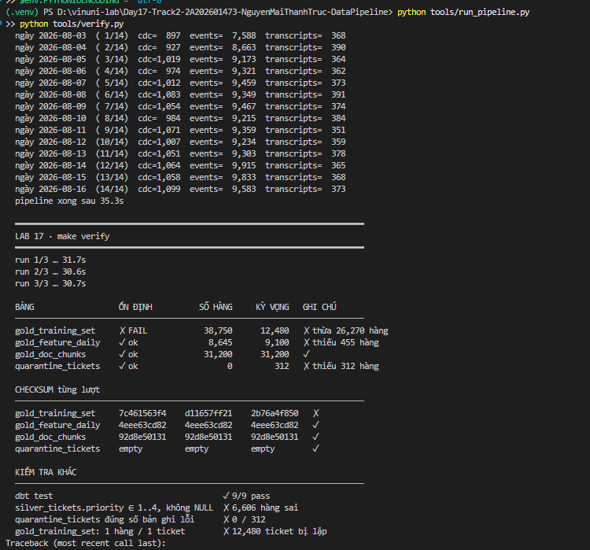

# Kết quả LAB 17 - Data Pipeline Engineering

Tài liệu này lưu bằng chứng thực thi cho từng nhiệm vụ. Trạng thái chỉ được chuyển sang
`Đạt` khi kết quả kiểm tra đáp ứng đầy đủ tiêu chí trong `RUBRIC.md`.

## Task 01 - Khắc phục bảng training không idempotent

**Trạng thái:** Chưa đạt, đã tái hiện lỗi baseline.

### Lệnh kiểm tra

```powershell
$env:PYTHONUTF8 = "1"
$env:PYTHONIOENCODING = "utf-8"
python tools/run_pipeline.py
python tools/verify.py
```

### Kết quả quan sát

| Tiêu chí | Kết quả hiện tại | Kỳ vọng | Trạng thái |
|---|---:|---:|---|
| Số hàng `gold_training_set` sau ba lượt | 38.750 | 12.480 | Chưa đạt |
| Số hàng thừa | 26.270 | 0 | Chưa đạt |
| Ticket bị lặp | 12.480 | 0 | Chưa đạt |
| Checksum ổn định qua ba lượt | Không | Có | Chưa đạt |

Checksum của `gold_training_set` thay đổi ở cả ba lượt chạy. Điều này xác nhận model
incremental đang ghi thêm dữ liệu cũ khi pipeline được chạy lại, thay vì cập nhật theo
grain một hàng trên mỗi `ticket_id`.

### Bằng chứng



### File cần xử lý

- `dbt/models/gold/gold_training_set.sql`
- `dags/ai_training_pipeline.py`

### Điều kiện chuyển sang Đạt

- `gold_training_set` có đúng 12.480 hàng.
- Không có `ticket_id` trùng.
- Checksum giống nhau qua ba lượt `verify` và các lượt chạy bổ sung.
- Cấu hình DAG đạt kiểm tra `catchup` và `max_active_runs`.

Sau khi hoàn tất sửa source, chạy lại `python tools/verify.py` và thay ảnh baseline bằng
bằng chứng mới hoặc bổ sung ảnh kết quả sau sửa vào mục này.
